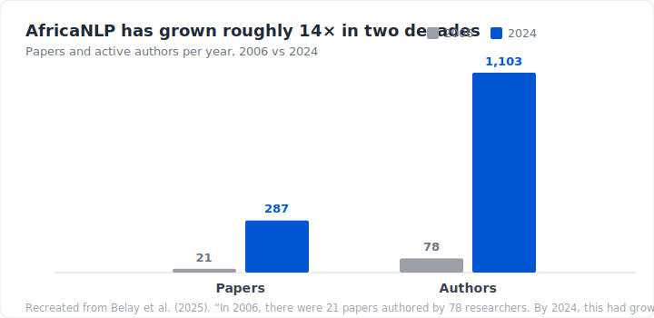
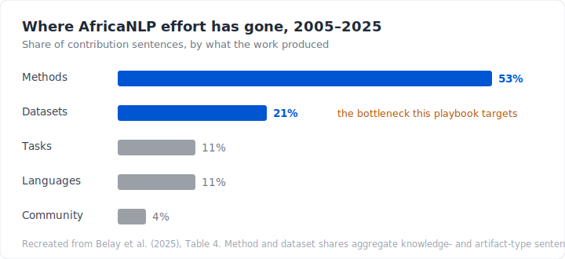

# 1. Introduction

> The bullet was the means of the physical subjugation. Language was the means of the spiritual subjugation.
>
> — Ngũgĩ wa Thiong'o, *Decolonising the Mind: The Politics of Language in African Literature* (1986)

Africa is home to roughly a third of the world's living languages, about 2,000 of the some 7,000 spoken on Earth ([Ethnologue, 2019](https://www.ethnologue.com/)). Almost none of them are visible to the systems now reshaping how the rest of the world reads, writes, searches, translates, and speaks. When a language model stumbles over Yorùbá, Chichewa, or Wolof, the cause is rarely the model. It is the data. The text and speech these systems learn from barely exist in a usable form, and where they do exist, they are too often wrong.

[Joshi et al. (2020)](https://aclanthology.org/2020.acl-main.560/) sort the world's languages into six tiers by how many resources they have. The bottom tier, the *left-behinds*, with essentially no labelled data and little prospect of being served by current methods, holds the overwhelming majority of languages, and African languages crowd into it. Most have no annotated corpus, no benchmark, no tools. They are missing not because they are small. Many have tens of millions of speakers. They are missing because no one has built the data.

:::tip[Help build the AfriPlaybook]
This playbook is open source and community-owned. You don't need to write a whole chapter to help. Fixing an error, translating a page, or sharing what worked on a real project all count. See [**Built in the open**](#built-in-the-open) below, or jump straight to the [contribution guide](https://github.com/MasakhaneHubNLP/MasakhanePlaybook/blob/main/README.md#ways-to-contribute).
:::

## Scraping will not fix this

When a language has no data, the instinct is to go and scrape more of it: crawl a wider slice of the web and trust that coverage will follow. For African languages, that instinct fails, for two separate reasons.

First, the web does not contain much African-language text, and what it contains is thin and noisy. When [Kreutzer et al. (2022)](https://aclanthology.org/2022.tacl-1.4/) audited the large multilingual crawls everyone trains on, they found that for many low-resource languages a large share of the data was mislabelled, machine-translated, or not language at all. At the tail, quality collapses along with quantity.

Second, and this cuts deeper, scraping treats people's words as a resource to be taken. Scholars of technology have a name for the pattern. [Couldry and Mejias (2019)](https://www.sup.org/books/sociology/costs-connection) call it *data colonialism*: the normalising of appropriating human life through data, much as historical colonialism normalised the appropriation of land and labour. [Birhane (2020)](https://script-ed.org/wp-content/uploads/2020/08/birhane.pdf) traces the shape this takes on the continent: an *algorithmic colonisation of Africa* in which the infrastructure, the models, and the value they produce are owned elsewhere, while African data is framed as an untapped abundance waiting to be mined.

Decolonising AI in Africa, then, is not a slogan to bolt onto a model. It is a question of who builds the data, who owns it, and who benefits. The answer this playbook is built around is plain: the people who speak the languages. Data made by and with those communities is not only more just. It is better. It carries dialect, register, and meaning no crawler can reach, and it comes with the consent and context that make it safe to use and to release.

The stakes run deeper than fairness. Long before the first language model, Ngũgĩ wa Thiong'o named language as the ground on which domination is won or refused: "the bullet was the means of the physical subjugation. Language was the means of the spiritual subjugation" (Ngũgĩ wa Thiong'o, *Decolonising the Mind*, 1986, p. 9). Language, for Ngũgĩ, is never only communication; it is a "carrier of culture," the "collective memory bank of a people's experience in history" (pp. 13, 15). Seen this way, an AI that cannot work in Yorùbá or Wolof, or that knows them only as scraped fragments, is his *cultural bomb* in a new casing, telling millions of speakers once more that their language is not where real knowledge lives. Building that data, in those languages, with the people who speak them, is how that message is refused.

We know this works, because it already has. [Masakhane](https://www.masakhane.io/), the grassroots community this playbook grows out of, has spent years proving the point. Its [participatory model](https://aclanthology.org/2020.findings-emnlp.195/) (Nekoto et al., 2020) puts native speakers at the centre of dataset creation rather than at the end of a pipeline. Out of it came resources that did not exist before: [MasakhaNER](https://direct.mit.edu/tacl/article/doi/10.1162/tacl_a_00416/107614/MasakhaNER-Named-Entity-Recognition-for-African) (Adelani et al., 2021), the first large, high-quality named-entity dataset for ten African languages, built by speakers rather than scraped; [MasakhaNEWS](https://arxiv.org/abs/2304.09972), news classification across sixteen; [AfriQA](https://github.com/masakhane-io/afriqa), the first cross-lingual open-retrieval question-answering dataset for African languages; and [AfroLID](https://aclanthology.org/2022.emnlp-main.128/), language identification spanning 517 languages. None came from a bigger crawl. They came from people.

## The field is growing, the data is not keeping up

African-language NLP is no longer a fringe pursuit. A recent survey of two decades of the field counts 1,902 papers from 4,901 authors between 2005 and 2025, and the curve is steep: in 2006 there were 21 papers from 78 researchers; by 2024 there were 287 papers from 1,103 ([Belay et al., 2025](https://arxiv.org/abs/2509.25477)).



But look at *what* that work produces. When the same survey hand-labelled nearly 7,800 contribution statements by what they actually delivered, methods accounted for 53 percent of the effort and new datasets for just 21 percent ([Belay et al., 2025](https://arxiv.org/abs/2509.25477)). The field is learning to model far faster than it is building the data those models learn from.



The reason is no mystery. A method can be carried from one language to the next; a dataset has to be built for each one, from scratch, by people who speak it. That means recruiting annotators, writing guidelines, running quality control, and securing consent. It is slow, unglamorous work, and it is rarely funded. So it lags, and the languages that most need data are the ones least likely to get it.

This is not an abstract worry about coverage. Which languages have data is starting to decide who can use AI at all. Look at where adoption is surging: Microsoft attributes Asia's 2026 jump to models growing stronger in local languages, with usage in South Korea climbing after a release that finally handled Korean well ([Global AI Diffusion, 2026](https://arxiv.org/abs/2511.02781)). Capability in a language pulls its speakers online. The mirror image is a widening divide. In early 2026, 27.5 percent of working-age adults in the Global North used generative AI, against 15.4 percent in the Global South, and the North was pulling away more than twice as fast, with African economies clustered at the foot of the global table. Even the benchmark used to certify "multilingual" progress counts only two African languages, Swahili and Yorùbá, among fourteen. Capability decides access, and for African languages that capability is waiting on data no one has built yet.

## Why we wrote this playbook

Almost every guide to building datasets quietly assumes English, a generous budget, and a problem someone has already solved once. Little of that holds when you are starting a corpus for a language with no prior resources, a volunteer team, and decisions to make that the literature never covers.

The AfriPlaybook is the manual we wish we had had. It is a practical, opinionated guide to building high-quality language datasets across the full lifecycle, from deciding what to collect, through annotation design, quality control, and documentation, to release. It is written for the real conditions of African-language NLP: low resources, multilingual teams, scarce funding, and communities who must stay the owners of what they help create. The aim is narrow: to lower the barrier to getting started, and to raise the floor on quality, so that the datasets this community produces are ones the world can trust and reuse.

That is the gap this playbook exists to close. It pairs a step-by-step guide through every stage of dataset creation with practical [annotation tooling](../documentation/tooling.md), so that a small team can move from a plan to a documented, released dataset without reinventing the process each time. Lowering the cost of building data is how the balance in the chart above begins to shift.

## Built in the open

This playbook is open source, and it is maintained by the AfricaNLP and Masakhane community. We invite researchers to contribute to a chapter or two, but the playbook is not just for researchers. It is for everyone who builds datasets for African languages, whether as a volunteer, a student, a community organizer, or a professional. The playbook is only as good as the people who contribute to it, and the people who build datasets are the ones who know best what it should say. The guide we have now is good, but it can be better, and it can only get better if more people add what they know. There are many ways to contribute:

- **Write** a chapter or section that fills a gap.
- **Review** existing chapters: correct an error, sharpen a claim, add a reference.
- **Share a case study** from a real project, including what went wrong.
- **Open a discussion** when you disagree with an approach. Disagreement makes the guide better.

Start with the [contribution guide](https://github.com/MasakhaneHubNLP/MasakhanePlaybook/blob/main/README.md#ways-to-contribute), raise an idea in [GitHub Discussions](https://github.com/MasakhaneHubNLP/MasakhanePlaybook/discussions), or join us on [Discord](https://discord.gg/ChNPHV2PPS). If you build datasets for African languages, or want to learn how, you are already part of who this is for. Come and build it with us.

## How to read this playbook

The playbook runs end-to-end through the dataset lifecycle, but you don't have to read it that way. Pick the path that fits where you are:

- **New to dataset design.** Start here, then read chapters 2–4 in order: Data Collection, Annotation Design, Data Quality. They build on each other and cover the foundations everyone needs.
- **You already have raw data and want help annotating it.** Go to chapter 3 (Annotation Design and Workforce Management), then chapter 4 (Data Quality Assurance and Validation).
- **You're working with a specific modality** (speech, multimodal, low-resource scripts). Skip to chapter 5 (Modality-Specific Task Design).
- **You're using LLMs to generate or augment data.** Read chapter 7 (LLM-Assisted and Synthetic Data Generation) for the trade-offs and safeguards.
- **You're preparing a dataset for release.** Read chapter 6 (Documentation, Data Release, and Governance) and chapter 9 (Dataset Lifecycle Management and Release Checklist).
- **You're coordinating a team or community group.** See [Onboarding a Team](./onboarding.md) and [Running a Playbook Workshop](./running-workshops.md).
- **You're offline or on a slow connection.** Use **Download PDF** in the navbar. The whole playbook bundles into one file, rebuilt on every release.
- **You'd rather read in another language.** Use the language switcher at the top-right. Translations are community-maintained and grow over time.

Throughout, you'll find practical templates (consent forms, annotation guidelines, governance checklists), worked examples from real African-language projects, and links to datasets and tools you can reuse. New terms are defined in the [glossary](/AfriPlaybook/glossary).

---

## How to cite this playbook

If the AfriPlaybook informs your research, teaching, or project, please cite it.

**BibTeX:**

```bibtex
@misc{masakhane2026playbook,
  author       = {{Masakhane Community}},
  title        = {AfriPlaybook: A Practical Guide for Building NLP Systems for African Languages},
  year         = {2026},
  publisher    = {Masakhane},
  url          = {https://warakacommunity.github.io/AfriPlaybook/},
  note         = {Open-source community resource}
}
```

**Plain text (APA-style):**

> Masakhane Community. (2026). *AfriPlaybook: A Practical Guide for Building NLP Systems for African Languages*. [https://warakacommunity.github.io/AfriPlaybook/](https://warakacommunity.github.io/AfriPlaybook/)

For other formats (MLA, Chicago, etc.) and a machine-readable [`CITATION.cff`](https://github.com/MasakhaneHubNLP/MasakhanePlaybook/blob/main/CITATION.cff), see the [/cite](/cite) page.

If you reference a specific chapter, please include the chapter title and its URL.
